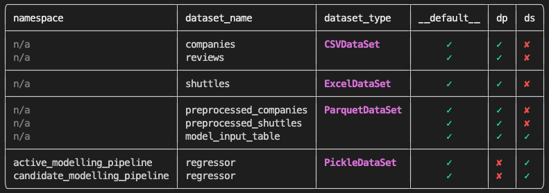

# kedro-rich

## Make your Kedro snazzy

This is a very early work in progress Kedro plugin that utilises the awesome rich library.

The intention with this piece of work is to battle test the idea, iron out the creases potentially to integrate this as a 1st class plugin hosted at kedro-org/plugins or if we're lucky, native functionality within Kedro itself.

I'm very much looking for help developing/testing this project so if you want to get involved please get in touch.

## Current Functionality

### Overridden `kedro run` command

- Does exactly the same as a regular Kedro run but kicks the progress bars into account.
- The load/save progress tasks focus purely on persisted data and ignore ephemeral `MemoryDataSets`.

- The progress bars are currently disabuled when using `ParallelRunner` since `MultiProcessing` is causing issues between `kedro` and `rich`. Further investigation if some sort of `Lock()` mechanism will allow for this to work.

### Logging via `rich.logging.RichHandler`

- This plugin changes the default `stdout` console logging handler in place of the class provided by `rich` .
- This is actually required to make the progress bars work without being broken onto new lines every time a new log message appears.
- At this point we also enable the [rich traceback handler](https://rich.readthedocs.io/en/stable/traceback.html).
- In order enable this purely plug-in side (i.e. not making the user change `logging.yml`) I've had to do an ugly bit of monkey patching. Keen to come up with a better solution here.

### Overridden `kedro catalog list` command

Accepts following options:

- `--format=yaml` provides YAML representation to stdout that can be piped into other utilities
- `--format=json` provides JSON representation to stdout that can be piped into other utilities
- `--format=table` provides pretty representation to console for human consumption

## Install the plug-in

### (Option 1) Cloning the repository

The plug-in is in very early days so it will be a while before (if) this makes it to pypi

1. Clone the repository
2. Run `make dev-install` to install this to your environment
3. Go to any Kedro 0.17.x project and see if it works! (Please let me know if it doesn't).

### (Option 2) Direct from GitHub

1. Run `pip install git+https://github.com/datajoely/kedro-rich` to install this to your environment.
2. Go to any Kedro 0.17.x project and see if it works! (Please let me know if it doesn't).

## Run end to end example

Running `make test-project` then `make test-run` will...

- Install the `kedro-rich` package into the environment
- Pull the 'spaceflights' `kedro-starter`
- Install requirements
- Execute `kedro run`
